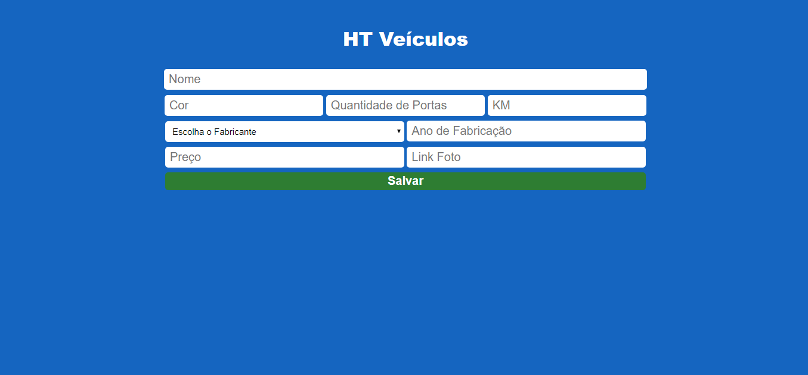
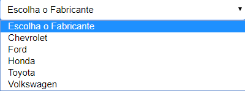
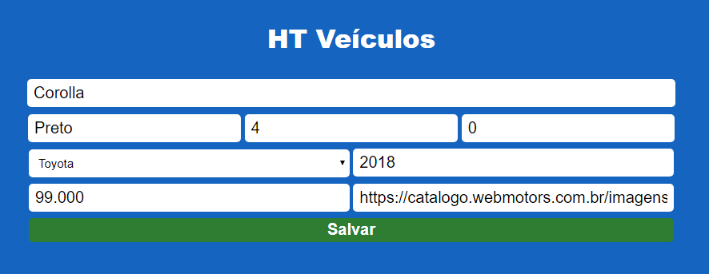
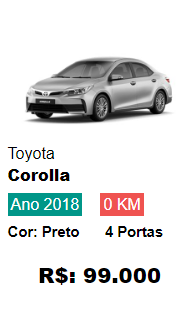
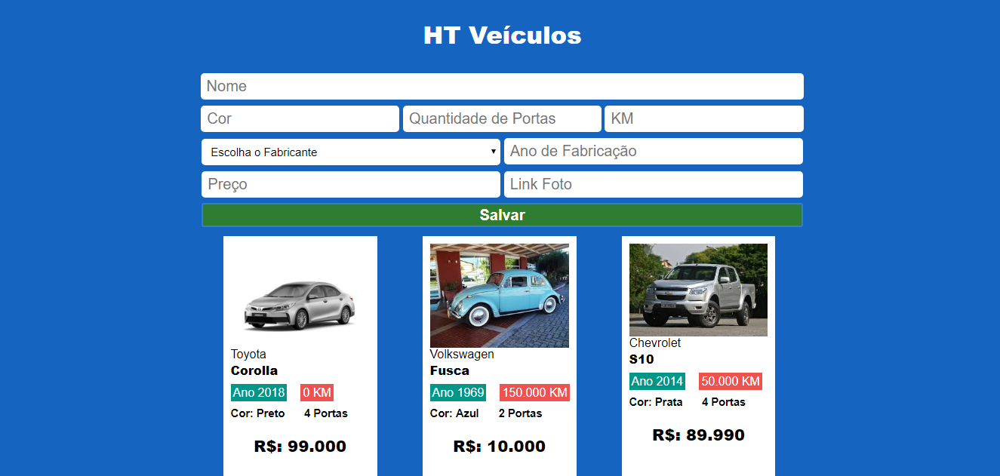

 
 

# Exercício HT Seminovos

## Descrição

A HT Seminovos é uma garagem que vende carros usados e esta precisando de um sistema para poder saber os carros que ela tem em estoque. Jõao é o dono da loja e ele trabalha com as seguintes marcas Chevrolet,Ford,Honda,Toyota e Volkswagen. Por falta de espaço a HT Seminovos só pode ter em estoque 3 carros por vez, não há espaço para mais veiculos.

Para ajudar o João, crie uma aplicação web capaz de armazenar até 3 carros.

Durante o cadastro de um novo carro as seguintes informações deverão ser preenchidas:

    - Nome
    - Cor
    - Quantidade de Portas
    - KM (Kilometragem que o carro já andou)
    - Fabricante
    - Ano da fabricação
    - Preço
    - Link da Foto

Para evitar erros de digitação, utilize o > select para que o João possa selecionar o fabricante do carro que está sendo cadastrado. 
Após realizar o cadastro do veiculo você deve criar um anúncio para conseguir vender o carro.

 
 
 
 
 
 
 

## **Imagens de Referência**
Tela inicial

 
 
 

Select Fabricante
 

 
 
 

Campos Preenchidos
 

 
 
 

Anúncio
 

 
 
 

Todos os carros cadastrados
 

## **Recado Importante:**
Utilize os conceitos de orientação a objetos vistos em aula.
 
Deve ser utilizado um objeto para cada veiculo, não deve ser utilizado lista.
 
Para criar o anúncio utilize uma div para cada veiculo da HT Seminovos
 
Lembre-se de limpar todos os campos após salvar um veiculo

 

  www.fabricadeprogramador.com.br

